<div align="center">



A Claude Code Skill for browser automation via WebSocket communication with the Chrome extension, enabling web navigation, interaction, screenshots, and page snapshots.

**English** | [中文](README_CN.md) | [Changelog](CHANGELOG.md)

</div>

---

## Features

### Core Capabilities
- **Page Navigation** - Navigate to URLs, go back/forward
- **Element Interaction** - Click (ref or coordinates), hover, type text, select options, drag elements
- **Element Search** - Search elements by keyword, get element coordinates
- **Multi-Tab Management** - List, open, switch, close tabs
- **Screenshots** - Capture visible page as PNG (save to file or return base64)
- **Page Snapshots** - Get ARIA accessibility tree for structured page analysis
- **Page Content** - Get plain text content, full HTML source code
- **Keyboard Input** - Press any key, submit forms
- **Console Logs** - Retrieve browser console output

### Architecture


The server communicates with the Browser MCP Chrome extension over WebSocket. Commands are sent as JSON via stdin, and results are returned via stdout.

### Additional Tools
- **Batch URL Resolver** - Resolve redirect URLs in bulk via HTTP requests (no browser required)

---

## System Requirements

| Requirement | Details |
|-------------|---------|
| Python | 3.8+ |
| Chrome | With Browser MCP extension installed |
| OS | Windows / macOS / Linux |
| [persistent-shell-skill](https://github.com/Tonyhzk/persistent-shell-skill) | Recommended for Claude Code to keep the server running |

---

## Installation

### 1. Clone the Repository

```bash
git clone https://github.com/Tonyhzk/chrome-agent-skill.git
```

### 2. Install the Chrome Extension

1. Open `chrome://extensions/` in Chrome
2. Enable **Developer mode**
3. Unzip the `.zip` extension package from `src/browser-chrome-agent/assets/`, then click "Load unpacked" and select the unzipped directory; or load the `src/browser-mcp-crx/` source directory directly
4. Pin the Browser MCP extension for easy access

### 3. Install Python Dependencies

```bash
pip3 install websockets
```

### 4. Set Up Shared Configuration (Optional)

If you use a shared `.claude` configuration across projects:

```bash
python3 setup_claude_dir.py
```

This creates a symlink from the project's `.claude` directory to your shared configuration.

---

## Quick Start

### 1. Start the WebSocket Server

```bash
python3 src/browser-chrome-agent/scripts/server.py --port 9009
```

### 2. Connect the Extension

Click the Browser MCP extension icon in Chrome and click **Connect**.

### 3. Send Commands

Send JSON commands via stdin (one per line):

```json
{"action": "navigate", "params": {"url": "https://example.com"}}
{"action": "snapshot", "params": {}}
{"action": "click", "params": {"ref": "s1e5"}}
{"action": "screenshot", "params": {"savePath": "./screenshot.png"}}
```

---

## Available Actions

| Action | Params | Description |
|--------|--------|-------------|
| `navigate` | `{"url": "..."}` | Navigate to URL |
| `go_back` | `{}` | Go back |
| `go_forward` | `{}` | Go forward |
| `click` | `{"ref": "s1e5"}` or `{"x": 500, "y": 100}` | Click element (ref or coordinates) |
| `hover` | `{"ref": "s1e5"}` | Hover over element |
| `type` | `{"ref": "s1e5", "text": "...", "submit": false}` | Type text |
| `select_option` | `{"ref": "s1e5", "values": ["..."]}` | Select dropdown option |
| `drag` | `{"startRef": "s1e5", "endRef": "s1e8"}` | Drag element |
| `press_key` | `{"key": "Enter"}` | Press key |
| `get_coordinates` | `{"ref": "s1e5"}` | Get element coordinates |
| `find_element` | `{"keyword": "search"}` | Search elements by keyword, return matching refs |
| `find_and_locate` | `{"keyword": "search", "index": 0}` | Search element and get coordinates immediately |
| `get_text` | `{}` or `{"max_length": 5000}` | Get page plain text content |
| `wait` | `{"time": 2}` | Wait (seconds) |
| `screenshot` | `{}` or `{"savePath": "path"}` | Capture screenshot |
| `snapshot` | `{}` or `{"snapshot_file": "path"}` | Get ARIA page snapshot. Supports `snapshot_file` to save to file, `inline: true` to return content directly, `max_length` to control truncation |
| `get_html` | `{"savePath": "path"}` | Get full page HTML source and save to file |
| `xpath_query` | `{"xpath": "//h1"}` | Execute XPath query on page. Supports `save_path` to save full results, `max_length` to control display length |
| `get_console_logs` | `{}` | Get console logs |
| `list_tabs` | `{}` | List all tabs |
| `new_tab` | `{"url": "..."}` | Open new tab (url optional) |
| `switch_tab` | `{"tabId": 123456}` | Switch to specified tab |
| `close_tab` | `{"tabId": 123456}` | Close specified tab |
| `status` | - | Check connection status |
| `quit` | - | Shut down server |

### Element References

Interactive actions (`click`, `hover`, `type`, etc.) use `ref` values from the ARIA snapshot to target elements. Use `find_element` or `find_and_locate` to search elements by keyword and get their refs or coordinates directly. Use `snapshot` only when you need to inspect the full page structure.

---

## Project Structure

```
chrome-agent-skill/
├── src/browser-chrome-agent/
│   ├── SKILL.md              # Skill definition
│   ├── scripts/
│   │   ├── server.py         # WebSocket server (main entry)
│   │   ├── context.py        # WebSocket connection manager
│   │   ├── tools.py          # Browser automation tools
│   │   ├── utils.py          # Utility functions
│   │   ├── batch_resolve_urls.py  # Batch URL resolver
│   │   └── requirements.txt  # Python dependencies
│   └── assets/               # Chrome extension packages
├── src/browser-mcp-crx/      # Modified Chrome extension source code
├── upstream/                 # Original Browser MCP extension & source archive
├── 0_Doc/                    # Documentation
├── 0_Design/                 # Design resources
├── setup_claude_dir.py       # Shared config symlink tool
├── CHANGELOG.md              # English changelog
└── CHANGELOG_CN.md           # Chinese changelog
```

---

## Acknowledgements

This project is a Python rewrite of [Browser MCP](https://github.com/BrowserMCP/mcp) (originally TypeScript/Node.js), adapted as a Claude Code Skill with a WebSocket-based stdin/stdout control interface.

- [Browser MCP](https://browsermcp.io/) - The original project and Chrome extension that powers browser automation

## License

[Apache License 2.0](LICENSE)

## Author

**Tonyhzk**

- GitHub: [@Tonyhzk](https://github.com/Tonyhzk)
- Email: 1125258615@qq.com