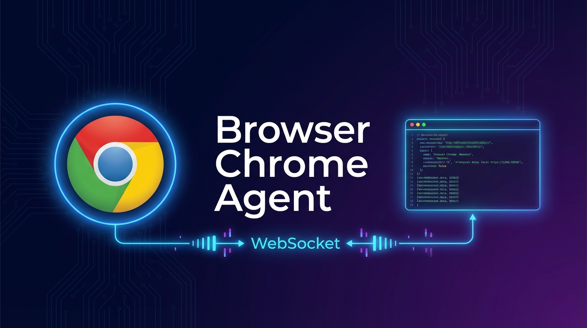
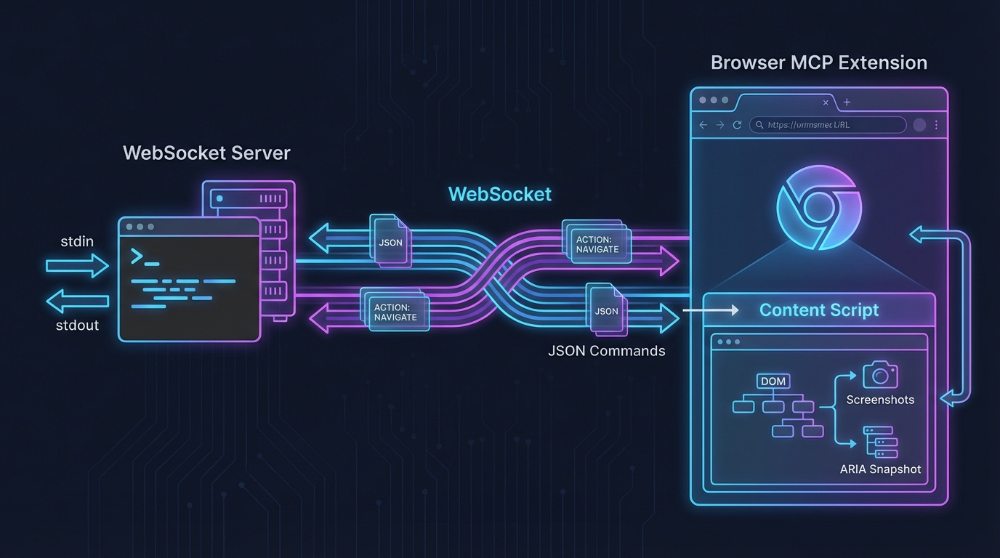

<div align="center">



通过 WebSocket 与 Chrome 扩展通信的 Claude Code 技能，实现网页导航、交互、截图和页面快照等浏览器自动化操作。

[English](README.md) | **中文** | [更新日志](CHANGELOG_CN.md)

</div>

---

## 功能特性

### 核心功能
- **页面导航** - 跳转 URL、前进/后退
- **元素交互** - 点击（ref 或坐标）、悬停、输入文本、选择下拉选项、拖拽
- **元素搜索** - 通过关键字搜索元素、获取元素坐标
- **多标签页管理** - 列出、新建、切换、关闭标签页
- **截图** - 捕获页面截图（保存文件或返回 base64）
- **页面快照** - 获取 ARIA 无障碍树，用于结构化页面分析
- **页面内容** - 获取纯文字内容、完整 HTML 源码
- **键盘输入** - 按键、提交表单
- **控制台日志** - 获取浏览器控制台输出

### 架构



服务器通过 WebSocket 与 Browser MCP Chrome 扩展通信。命令以 JSON 格式通过 stdin 发送，结果通过 stdout 返回。

### 附加工具
- **批量 URL 解析器** - 通过 HTTP 请求批量解析跳转链接（无需浏览器）

---

## 系统要求

| 依赖 | 说明 |
|------|------|
| Python | 3.8+ |
| Chrome | 需安装 Browser MCP 扩展 |
| 操作系统 | Windows / macOS / Linux |
| [persistent-shell-skill](https://github.com/Tonyhzk/persistent-shell-skill) | 推荐安装，用于在 Claude Code 中保持服务器持续运行 |

---

## 安装

### 1. 克隆仓库

```bash
git clone https://github.com/Tonyhzk/chrome-agent-skill.git
```

### 2. 安装 Chrome 扩展

1. 在 Chrome 地址栏输入 `chrome://extensions/`
2. 开启**开发者模式**
3. 解压 `src/browser-chrome-agent/assets/` 中的 `.zip` 扩展包，点击「加载已解压的扩展程序」选择解压目录；或直接加载 `src/browser-mcp-crx/` 源码目录
4. 固定 Browser MCP 扩展图标以便快速访问

### 3. 安装 Python 依赖

```bash
pip3 install websockets
```

### 4. 配置共享目录（可选）

如果你在多个项目间共享 `.claude` 配置：

```bash
python3 setup_claude_dir.py
```

此脚本会创建符号链接，将项目的 `.claude` 目录指向共享配置。

---

## 快速开始

### 1. 启动 WebSocket 服务器

```bash
python3 src/browser-chrome-agent/scripts/server.py --port 9009
```

### 2. 连接扩展

点击 Chrome 中的 Browser MCP 扩展图标，点击 **Connect**。

### 3. 发送命令

通过 stdin 发送 JSON 命令（每行一条）：

```json
{"action": "navigate", "params": {"url": "https://example.com"}}
{"action": "snapshot", "params": {}}
{"action": "click", "params": {"ref": "s1e5"}}
{"action": "screenshot", "params": {"savePath": "./screenshot.png"}}
```

---

## 可用操作

| 操作 | 参数 | 说明 |
|------|------|------|
| `navigate` | `{"url": "..."}` | 导航到 URL |
| `go_back` | `{}` | 后退 |
| `go_forward` | `{}` | 前进 |
| `click` | `{"ref": "s1e5"}` 或 `{"x": 500, "y": 100}` | 点击元素（支持 ref 或坐标） |
| `hover` | `{"ref": "s1e5"}` | 悬停元素 |
| `type` | `{"ref": "s1e5", "text": "...", "submit": false}` | 输入文本 |
| `select_option` | `{"ref": "s1e5", "values": ["..."]}` | 选择下拉选项 |
| `drag` | `{"startRef": "s1e5", "endRef": "s1e8"}` | 拖拽 |
| `press_key` | `{"key": "Enter"}` | 按键 |
| `get_coordinates` | `{"ref": "s1e5"}` | 获取元素坐标位置 |
| `find_element` | `{"keyword": "搜索"}` | 通过关键字搜索元素，返回匹配的 ref 列表 |
| `find_and_locate` | `{"keyword": "搜索", "index": 0}` | 搜索元素并立即获取坐标 |
| `get_text` | `{}` 或 `{"max_length": 5000}` | 获取页面纯文字内容 |
| `wait` | `{"time": 2}` | 等待（秒） |
| `screenshot` | `{}` 或 `{"savePath": "路径"}` | 截图 |
| `snapshot` | `{}` 或 `{"snapshot_file": "路径"}` | 获取页面 ARIA 快照（传 snapshot_file 保存到文件） |
| `get_html` | `{"savePath": "路径"}` | 获取页面完整 HTML 源码并保存到文件 |
| `get_console_logs` | `{}` | 获取控制台日志 |
| `list_tabs` | `{}` | 列出所有标签页 |
| `new_tab` | `{"url": "..."}` | 打开新标签页（url 可选） |
| `switch_tab` | `{"tabId": 123456}` | 切换到指定标签页 |
| `close_tab` | `{"tabId": 123456}` | 关闭指定标签页 |
| `status` | - | 查询连接状态 |
| `quit` | - | 关闭服务器 |

### 元素引用

交互操作（`click`、`hover`、`type` 等）使用 ARIA 快照中的 `ref` 值定位元素。优先使用 `find_element` 或 `find_and_locate` 通过关键字搜索元素并获取 ref 或坐标，仅在需要查看完整页面结构时使用 `snapshot`。

---

## 项目结构

```
chrome-agent-skill/
├── src/browser-chrome-agent/
│   ├── SKILL.md              # 技能定义
│   ├── scripts/
│   │   ├── server.py         # WebSocket 服务器（主入口）
│   │   ├── context.py        # WebSocket 连接管理
│   │   ├── tools.py          # 浏览器自动化工具
│   │   ├── utils.py          # 工具函数
│   │   ├── batch_resolve_urls.py  # 批量 URL 解析器
│   │   └── requirements.txt  # Python 依赖
│   └── assets/               # Chrome 扩展安装包
├── src/browser-mcp-crx/      # Chrome 扩展修改版源码
├── upstream/                 # 原始 Browser MCP 扩展及源码存档
├── 0_Doc/                    # 文档
├── 0_Design/                 # 设计资源
├── setup_claude_dir.py       # 共享配置符号链接工具
├── CHANGELOG.md              # 英文更新日志
└── CHANGELOG_CN.md           # 中文更新日志
```

---

## 致谢

本项目是 [Browser MCP](https://github.com/BrowserMCP/mcp)（原 TypeScript/Node.js）的 Python 重写版本，改造为 Claude Code Skill，采用基于 WebSocket 的 stdin/stdout 控制接口。

- [Browser MCP](https://browsermcp.io/) - 原始项目及提供浏览器自动化能力的 Chrome 扩展

## 许可证

[Apache License 2.0](LICENSE)

## 作者

**Tonyhzk**

- GitHub: [@Tonyhzk](https://github.com/Tonyhzk)
- Email: 1125258615@qq.com